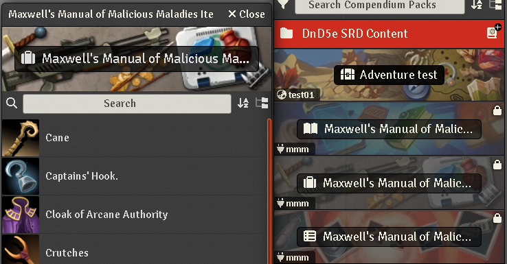
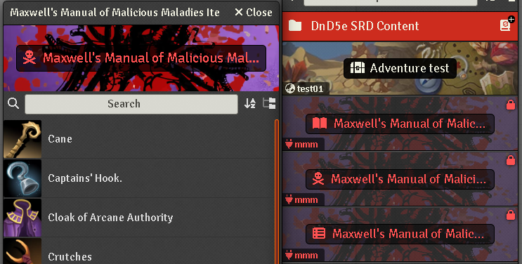
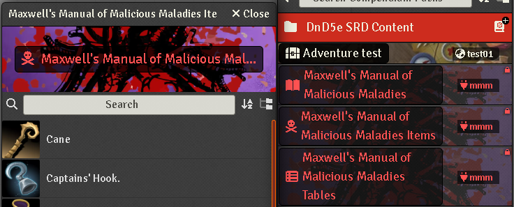

### Compendium Themer


[](https://forge-vtt.com/bazaar#package=Border-Control)


[](https://www.foundryvtt-hub.com/package/Border-Control/)


[](https://weblate.foundryvtt-hub.com/engage/Border-Control/)

### If you want to buy me a coffee [](https://www.patreon.com/p4535992)

Add some custom compendium banner images, text color and style to the compendium directory. A small module to help better search for specific module compendiums when they start to be several.

Table of supported modules

| Module ID                                             | NOTES                                           |
|-------------------------------------------------------|-------------------------------------------------|
| [mmm](https://github.com/theripper93/Maxwell-s-Manual-of-Malicious-Maladies) | Maxwell's Manual of Malicious Maladies - A module for all your lingering injuries needs (dnd5e) |
| compendiums-mythos-workshop-dnd5e                     | A shared compendium private module 

ON DEMAND other modules on request open a issue on the github project

### Example

**BEFORE**



**AFTER (without minimal css enabled)**



**AFTER (with minimal css enabled)**



## Installation

It's always easiest to install modules from the in game add-on browser.

To install this module manually:
1.  Inside the Foundry "Configuration and Setup" screen, click "Add-on Modules"
2.  Click "Install Module"
3.  In the "Manifest URL" field, paste the following url:
`https://raw.githubusercontent.com/p4535992/foundryvtt-compendium-themer/master/src/module.json`
4.  Click 'Install' and wait for installation to complete
5.  Don't forget to enable the module in game using the "Manage Module" button


## Known issue

# API

TODO

# Build

## Install all packages

```bash
npm install
```

### dev

`dev` will let you develop you own code with hot reloading on the browser

```bash
npm run dev
```

## npm build scripts

### build

`build` will build and set up a symlink between `dist` and your `dataPath`.

```bash
npm run build
```

### build-watch

`build-watch` will build and watch for changes, rebuilding automatically.

```bash
npm run build-watch
```

### prettier-format

`prettier-format` launch the prettier plugin based on the configuration [here](./.prettierrc)

```bash
npm run-script prettier-format
```

## [Changelog](./CHANGELOG.md)

## Issues

Any issues, bugs, or feature requests are always welcome to be reported directly to the [Issue Tracker](https://github.com/p4535992/foundryvtt-compendium-themer/issues ), or using the [Bug Reporter Module](https://foundryvtt.com/packages/bug-reporter/).

## License

- **[Custom Compendium Banner](https://github.com/phenomen/fvtt-custom-compendium-banners)** : [???]()

This package is under an [MIT license](LICENSE) and the [Foundry Virtual Tabletop Limited License Agreement for module development](https://foundryvtt.com/article/license/).

## Credit

- Ty to [phenomen](https://github.com/phenomen) and the module [Custom Compendium Banner](https://github.com/phenomen/fvtt-custom-compendium-banners)
